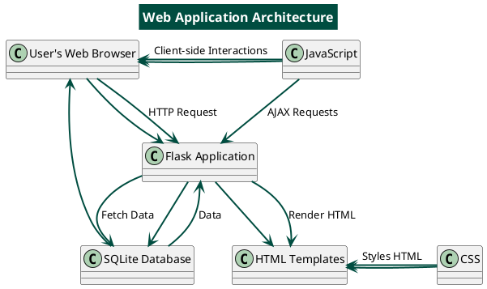
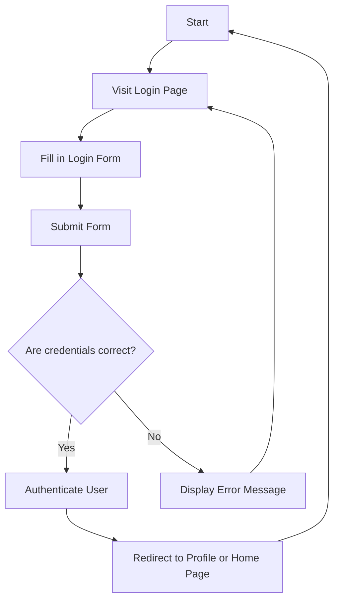
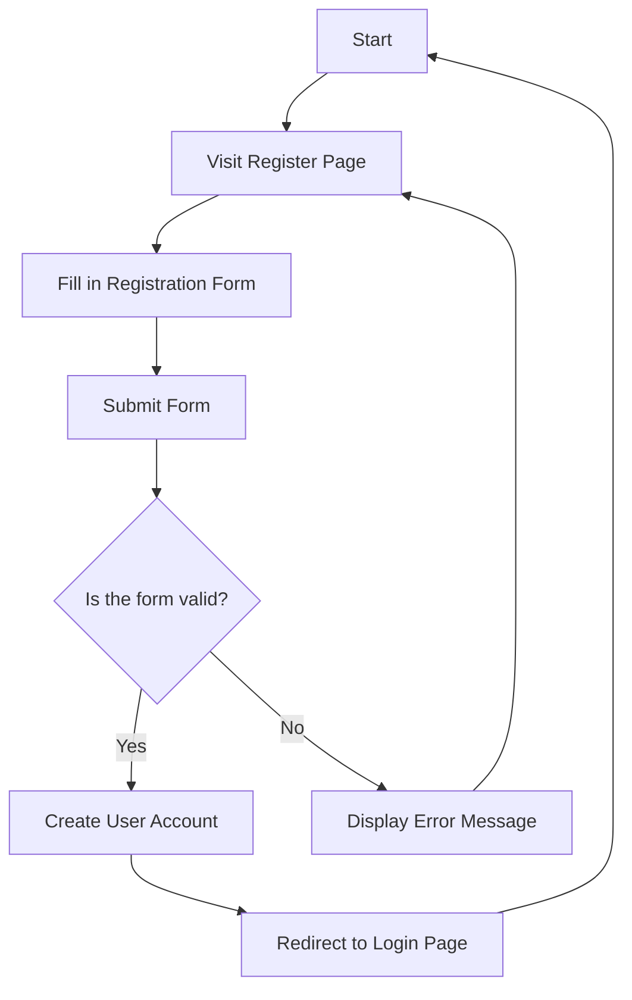
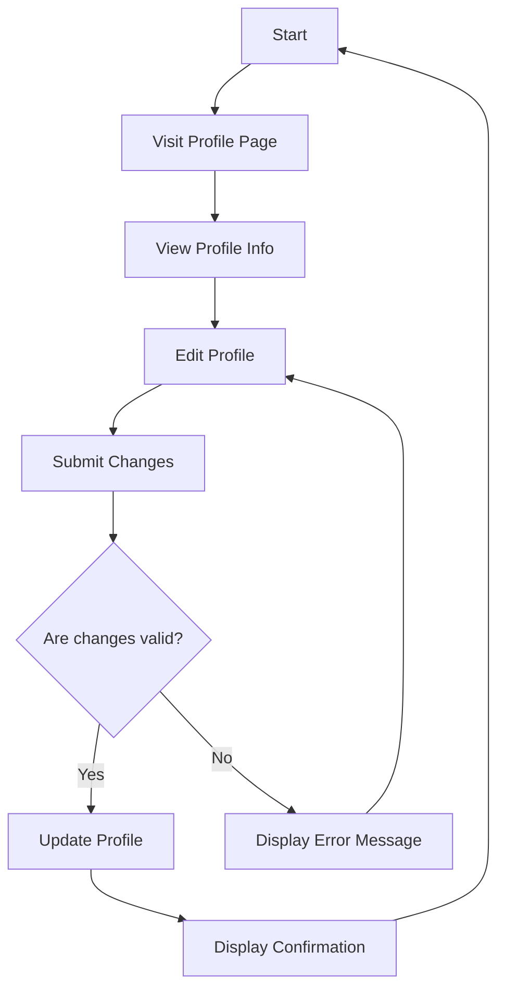
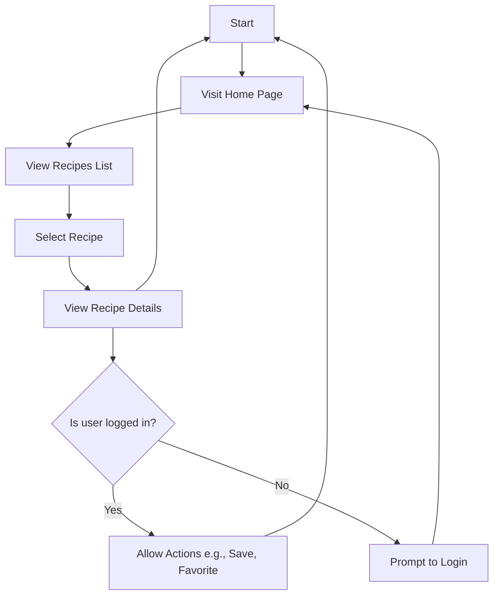

# Technical Documentation

This document provides an in-depth explanation of the software architecture, API endpoints, data models, and other
critical components used in the web application.

# Table of Contents

## [Frontend Details](#frontend-details)

## Backend Overview

- [Application Architecture](#application-architecture)

## [Directory Structure](#directory-structure)

## [Flask Routes](#flask-routes)

## [Models](#models)

- [User Model](#user-model)
- [Favourites Model](#favourites-model)
- [user_favourites (Association Table)](#user_favourites-association-table)
- [UML Diagram of the many-to-many relationship](#uml-diagram-of-the-many-to-many-relationship)
- [Recipes Model](#recipes-model)

## API Endpoints

- [Portion sizes feature](#portion-sizes-feature)
    - [Fetching Portion sizes](#fetching-portion-sizes)
    - [Example of Success Response (rendered data)](#example-of-success-response-rendered-data)
    - [Example Code](#example-code)
    - [UI Form Example](#ui-form-example)
    - [JavaScript for Portion Sizes Feature](#javascript-for-portion-sizes-feature)
        - [Key Components](#key-components)
        - [JavaScript Code](#javascript-code)

- [Top Stories Feature](#top-stories-feature)
    - [Example of Success Response (rendered data)](#example-of-success-response-rendered-data)
    - [Example Code](#example-code-1)
    - [UI Form Example](#ui-form-example-1)

## Recipe Function

- [Fetching meal detail from database](#fetching-meal-detail-from-database)
- [Querying database for search](#querying-database-for-search)

## [User Guide](#user-guide)

## [Release Notes](#release-notes)

----------------------------------------------------------------------------------

## Frontend Details

### HTML, CSS, and JavaScript

The frontend is primarily structured using HTML, styled using CSS, and made interactive with JavaScript.

- HTML: Provides the structure of each webpage.
    - Header: Displays the site’s logo or header image.
    - Navbar: Includes navigation links, dropdown menus for recipes and feeding tips, and user authentication links.
    - Main Content: Features the main content of the page, including dynamic sections like top recipes and stories.
    - Sidebar: Shows today’s top stories, which are dynamically loaded based on available articles.
    - Footer: Contains copyright information and any other footer content.
    - Flash Messages: Used for displaying flash messages, typically for user feedback.
- CSS: Responsible for the styling and layout of the application. Main CSS files include:
    - `main.css`: General website-wide styles.
    - `header.css`, `navbar.css`, `footer.css`: Styles for different sections of the layout.
    - Additional styles for recipe displays and user interface elements.
- JavaScript: Key functionalities include:
    - Portions Management: Fetches portion sizes and updates them dynamically.
    - User Notifications: Displays notifications to users.

## Backend Overview

The backend is built using Flask, serving as a bridge between the database and the frontend, and handling HTTP requests
and business logic.

### Application Architecture

The application follows a modular structure, with the main components being:

1. Initialization and Configuration:

Located in `mod/__init__.py`, this file sets up the Flask application and the database.

2. Main Application Runner:

`server_main.py` serves as the entry point for running the Flask server. This file also handles database migrations,
logging configurations and initializes other components.

3. Database Models:

Defined in `mod/models.py,` these models represent the core data structures, such as users, recipes, and favourites.

4. Routes and Views:

The main request handlers are located in `mod/app.py`. These routes handle user interactions like searching recipes,
managing user profiles, and retrieving recipe details.



## Directory Structure

```
├── app.log                   # Info, Error and Debug logs
├── migrations                # Database migrations
├── mod
│ ├── app.py                  # Request handlers
│ ├── database.db             # Database    
│ ├── __init__.py             # Flask and database setup
│ ├── models.py               # Database models
│ └── user_manager.py         # Form classes for registration and login
├── server_main.py            # Main application file   
├── static                    # Static files
│ ├── allrecipes.csv
│ ├── css
│ ├── images
│ └── js
└── templates                 # HTML templates
  ├── 404.html
  ├── feeding_stages.html
  ├── _formhelpers.html
  ├──healthy_eating.html
  ├── index.html
  ├── login.html
  ├── meal_detail.html
  ├── profile.html
  ├── recipes1.html
  ├── recipes2.html
  ├── recipes3.html
  ├── recipes.html
  ├── register_user.html
  ├── search_results.html
  ├── signs.html
  └── _top_recipe.html
```

## Flask Routes
### 1. Index Route

**URL:** `/`

**Method:** `GET`

**Description:** The main landing page of the application. Displays a list of recipes and top stories.

**Parameters:** None

**Responses:**

- **200 OK:** Successfully returns the index page with recipes and articles.
- **Content:** HTML content of the index page.


### 2. Login Route

**URL:** `/login`

**Method:** `GET` and `POST`

**Description:** Displays the login page and handles user authentication.

**Parameters:**

- **GET Request:** No parameters.
- **POST Request:**
  - `username` (string): The username of the user.
  - `password` (string): The password of the user.

**Responses:**

- **GET Request:**
  - **200 OK:** Successfully returns the login page.
  - **Content:** HTML content of the login page.
- **POST Request:**
  - **200 OK:** Successfully logs in the user and redirects to the profile or home page.
  - **302 Found:** Redirects to the profile or home page.
  - **401 Unauthorized:** If login credentials are invalid.



### 3. Register Route

**URL:** `/register`

**Method:** `GET` and `POST`

**Description:** Displays the registration page and handles user registration.

**Parameters:**

- **GET Request:** No parameters.
- **POST Request:**
  - `username` (string): The username for the new account.
  - `password` (string): The password for the new account.
  - `email` (string): The email address of the user.

**Responses:**

- **GET Request:**
  - **200 OK:** Successfully returns the registration page.
  - **Content:** HTML content of the registration page.
- **POST Request:**
  - **200 OK:** Successfully creates a new user and redirects to the login page.
  - **302 Found:** Redirects to the login page.
  - **400 Bad Request:** If registration data is invalid.



### 4. Profile Route

**URL:** `/profile`

**Method:** `GET` and `POST`

**Description:** Displays and updates the user profile.

**Parameters:**

- **GET Request:** No parameters.
- **POST Request:**
  - `first_name` (string): Updated first name of the user.
  - `last_name` (string): Updated last name of the user.
  - `email` (string): Updated email address of the user.
  - `profile_image` (string): Updated profile image URL.

**Responses:**

- **GET Request:**
  - **200 OK:** Successfully returns the profile page.
  - **Content:** HTML content of the profile page with user details.
- **POST Request:**
  - **200 OK:** Successfully updates user profile.
  - **302 Found:** Redirects to the profile page with updated information.
  - **400 Bad Request:** If update data is invalid.



### 5. Recipes Route

**URL:** `/recipes`

**Method:** `GET`

**Description:** Displays a list of recipes.

**Parameters:** None

**Responses:**

- **200 OK:** Successfully returns the recipes page with a list of recipes.
- **Content:** HTML content of the recipes page.



### 6. Meal Detail Route

**URL:** `/meal_detail/<meal_id>`

**Method:** `GET`

**Description:** Displays details of a specific meal.

**Parameters:**

- `meal_id` (integer): The ID of the meal to display.

**Responses:**

- **200 OK:** Successfully returns the meal detail page.
- **Content:** HTML content with detailed information about the specified meal.


### 7. Search Route

**URL:** `/search`

**Method:** `POST`

**Description:** Handles search queries for recipes.

**Parameters:**

- `search` (string): The search term used to query recipes.

**Responses:**

- **200 OK:** Successfully returns search results based on the query.
- **Content:** HTML content with search results.


### 8. Logout Route

**URL:** `/logout`

**Method:** `POST`

**Description:** Logs out the current user.

**Parameters:** None

**Responses:**

- **200 OK:** Successfully logs out the user and redirects to the home page.
- **302 Found:** Redirects to the home page after logout.


### 9. Debug Route

**URL:** `/debug`

**Method:** `GET`

**Description:** Displays debugging information.

**Parameters:** None

**Responses:**

- **200 OK:** Successfully returns debugging information.
- **Content:** HTML content with debugging details.


## Models

### User Model

The Users model represents the `users` of the system. Each user has basic attributes like a username, first and last
name, email, and a password, along with optional attributes such as a profile image. This model includes functionality
for securely hashing and checking passwords. It also maintains a relationship with the `Favourites` model through the
association table `user_favourites`, allowing users to have a list of their favourite recipes.

```
class Users(UserMixin, db.Model):
    """ Table for users """
    __tablename__ = 'users'

    id = db.Column(db.Integer, primary_key=True, autoincrement=True)
    profile_image = db.Column(db.String(100), nullable=True)
    username = db.Column(db.String(100), unique=True, nullable=False)
    first_name = db.Column(db.String(100), nullable=False)
    last_name = db.Column(db.String(100), nullable=False)
    email = db.Column(db.String(100), nullable=False)
    password = db.Column(db.String(100), nullable=False)

    def set_password(self, password):
        self.password = generate_password_hash(password)

    def check_password(self, password):
        return check_password_hash(self.password, password)

    # Relationship to Favourites
    favourites = db.relationship('Favourites', secondary=user_favourites, backref=db.backref('users', lazy='dynamic'))
```

### Favourites Model

The `Favourites` model represents a user's favourite recipes. Each favourite has an associated recipe with essential
details like the recipe's ID, title, and image. This model is linked to the `Users` model through the association table
`user_favourites`, allowing users to save their favourite recipes.

```
class Favourites(db.Model):
    __tablename__ = 'favourites'

    id = db.Column(db.Integer, primary_key=True, autoincrement=True)
    recipe_id = db.Column(db.Integer, nullable=False)
    recipe_title = db.Column(db.String(200), nullable=False)
    recipe_image = db.Column(db.String(200), nullable=False)
```

### user_favourites (Association Table)

This table serves as a bridge for the many-to-many relationship.

```
user_favourites = db.Table('user_favourites',
                           db.Column('user_id', db.Integer, db.ForeignKey('users.id'), primary_key=True),
                           db.Column('favourite_id', db.Integer, db.ForeignKey('favourites.id'), primary_key=True)
                           )
```

### UML Diagram of the many-to-many relationship

```mermaid
classDiagram
    class Users {
        +id : int <<PK>>
        +profile_image : string
        +username : string
        +first_name : string
        +last_name : string
        +email : string
        +password : string
        +set_password()
        +check_password()
    }

    class Favourites {
        +id : int <<PK>>
        +recipe_id : int
        +recipe_title : string
        +recipe_image : string
    }

    class user_favourites {
        +user_id : int <<FK>>
        +favourite_id : int <<FK>>
    }

    Users "1" -- "0..*" user_favourites : includes
    Favourites "1" -- "0..*" user_favourites : marked as favourite
    
    %% Style definitions
    style Users fill:#454B1B,stroke:#333,stroke-width:2px
    style Favourites fill:#900C3F,stroke:#333,stroke-width:2px
    style user_favourites fill:#581845,stroke:#333,stroke-width:2px
```




### Recipes Model

The `Recipe` model holds information about various recipes. Each recipe contains details such as its title, description,
preparation time, cooking time, serving size, age group, ingredients, and method. It also includes functionality to log
views for analytics and convert a recipe to a dictionary format.

```
class Recipe(db.Model):
    __tablename__ = 'recipes'

    id = db.Column(db.Integer, primary_key=True, autoincrement=True)
    title = db.Column(db.String(200), nullable=False)
    description = db.Column(db.Text, nullable=True)
    serves = db.Column(db.String(50), nullable=True)
    prep_time = db.Column(db.String(50), nullable=True)
    cook_time = db.Column(db.String(50), nullable=True)
    age_group = db.Column(db.String(50), nullable=True)
    ingredients = db.Column(db.Text, nullable=True)
    method = db.Column(db.Text, nullable=True)
    url = db.Column(db.String(200), nullable=True)
    image_url = db.Column(db.String(200), nullable=True)
    views = db.Column(db.Integer, default=0)
    last_viewed = db.Column(db.DateTime, nullable=True)

    def log_view(self):
        """Increment the view count and update the last viewed date."""
        self.views = self.views + 1 if self.views is not None else 1
        self.last_viewed = datetime.utcnow()
        db.session.add(self)

    def to_dict(self):
        """Convert the Recipe instance to a dictionary."""
        return {
            'id': self.id,
            'title': self.title,
            'description': self.description,
            'serves': self.serves,
            'prep_time': self.prep_time,
            'cook_time': self.cook_time,
            'age_group': self.age_group,
            'ingredients': self.ingredients,
            'method': self.method,
            'url': self.url,
            'image_url': self.image_url,
            'views': self.views,
            'last_viewed': self.last_viewed.isoformat() if self.last_viewed else None
        }
```

## API Endpoints

### Portion sizes feature

#### Fetching Portion sizes

- Endpoint: `/healthy_eating`
- Method: `GET`, `POST`
- Description: This endpoint allows users to retrieve portion sizes for specific age groups (baby, toddler, family). The
  user selects an age group, and the corresponding portion sizes are fetched using the Nutritionix API.
- Response:
    - Success: Renders the `healthy_eating.html` template with the portion sizes corresponding to the selected age
      group. The portion sizes include the `food_name`, `serving_qty`, and `serving_unit` for each food item.
    - Failure: If there is an error during the API call (e.g., network issues or timeout), the page is rendered without
      portion sizes, and an empty list is passed.

#### Example of Success Response (rendered data)

```
[
  {
    "food_name": "Apple",
    "serving_qty": "1",
    "serving_unit": "medium"
  },
  {
    "food_name": "Banana",
    "serving_qty": "1",
    "serving_unit": "small"
  }
]
```

#### Example Code

```python
@other_routes.route('/healthy_eating', methods=['GET', 'POST'])
def healthy_eating():
    articles = get_topics_logic()
    age_group = request.form.get('age_group')
    portion_sizes = []

    if age_group:
        portion_sizes = get_portion_sizes(age_group)

    return render_template('healthy_eating.html', portion_sizes=portion_sizes, age_group=age_group, articles=articles)


def get_portion_sizes(age_group):
    portions_api_key = '4f704df26c022d7001e8c639f94ed667'
    app_id = 'c51d8bff'
    headers = {
        'x-app-id': app_id,
        'x-app-key': portions_api_key,
        'Content-Type': 'application/json'
    }

    query = f'{age_group} food'
    endpoint = 'https://trackapi.nutritionix.com/v2/search/instant'
    params = {'query': query}

    try:
        response = requests.get(endpoint, headers=headers, params=params, timeout=10)
        response.raise_for_status()
        data = response.json()

        foods = data.get('branded', []) + data.get('common', [])
        portion_sizes = [{
            'food_name': food['food_name'],
            'serving_qty': food.get('serving_qty', 'N/A'),
            'serving_unit': food.get('serving_unit', 'N/A')
        } for food in foods]

        return portion_sizes
    except requests.exceptions.RequestException as e:
        print(f'Error fetching portion sizes: {e}')
        return []
```

#### UI Form Example

The corresponding HTML form allows users to select an age group to fetch the portion sizes.

```html

<div class="portion-sizes-section">
    <h2>Portion Sizes by Age Group</h2>
    <form id="age-group-form" method="POST" action="{{ url_for('other_routes.healthy_eating') }}">
        <label for="age_group">Select Age Group:</label>
        <select id="age_group" name="age_group">
            <option value="baby" selected>Baby</option>
            <option value="toddler" selected>Toddler</option>
            <option value="family" selected>Family</option>
        </select>
        <button type="submit">Submit</button>
    </form>

    <div id="portion-sizes-container">
        <ul id="portion-sizes-list">
            
            <li>{{ portion.food_name }}: {{ portion.serving_qty }} {{ portion.serving_unit }}</li>
            
        </ul>
        <button id="load-more" style="display: none;">Load More</button>
    </div>
</div>
```

#### JavaScript for Portion Sizes Feature

This section describes the client-side JavaScript used to handle the age group form, fetch data from the server, and
manage the "Load More" functionality.

##### Key Components:

- Event Listeners:
    - `DOMContentLoaded`: Waits for the page to load before initializing functionality.
    - `form.submit`: Handles the age group form submission without reloading the page.
    - `loadMoreButton.click`: Loads more portion sizes without reloading the page.

##### JavaScript Code:

```javascript
document.addEventListener('DOMContentLoaded', function() {
    const form = document.getElementById('age-group-form');
    const portionSizesList = document.getElementById('portion-sizes-list');
    const loadMoreButton = document.getElementById('load-more');
    let currentOffset = 0;
    const itemsPerPage = 5;
    let totalItems = 0;
    let ageGroup = '';

    // Handle form submission
    form.addEventListener('submit', function(event) {
        event.preventDefault(); // Prevent page reload
        ageGroup = document.getElementById('age_group').value;
        currentOffset = 0; // Reset the offset for new search
        portionSizesList.innerHTML = ''; // Clear previous results
        loadMoreButton.style.display = 'none'; // Hide "Load More" initially
        fetchPortionSizes(); // Fetch portion sizes for the selected age group
    });

    // Handle "Load More" button click
    loadMoreButton.addEventListener('click', function() {
        currentOffset += itemsPerPage;
        fetchPortionSizes();
    });

    // Function to fetch portion sizes
    function fetchPortionSizes() {
        fetch(`/proxy?age_group=${encodeURIComponent(ageGroup)}&offset=${currentOffset}&limit=${itemsPerPage}`)
            .then(response => {
                if (!response.ok) {
                    throw new Error('Network response was not ok');
                }
                return response.json();
            })
            .then(data => {
                const items = [...(data.branded || []), ...(data.common || [])];

                if (items.length > 0) {
                    totalItems = items.length;

                    // Display portion sizes on the page
                    items.slice(currentOffset, currentOffset + itemsPerPage).forEach(item => {
                        const listItem = document.createElement('li');
                        listItem.textContent = `${item.food_name}: ${item.serving_qty || 'N/A'} ${item.serving_unit || 'N/A'}`;
                        portionSizesList.appendChild(listItem);
                    });

                    // Show or hide "Load More" button based on item availability
                    if (currentOffset + itemsPerPage < totalItems) {
                        loadMoreButton.style.display = 'block';
                    } else {
                        loadMoreButton.style.display = 'none';
                    }
                } else {
                    loadMoreButton.style.display = 'none';
                    const noDataMessage = document.createElement('li');
                    noDataMessage.textContent = 'No data found for the selected age group.';
                    portionSizesList.appendChild(noDataMessage);
                }
            })
            .catch(error => {
                console.error('Error fetching data:', error);
                const errorMessage = document.createElement('li');
                errorMessage.textContent = 'An error occurred while fetching data.';
                portionSizesList.appendChild(errorMessage);
            });
    }
});
```

### Top Stories Feature

The "Top Stories" feature displays relevant articles fetched from the NHS API, focusing on topics like child development
and childhood illness. The stories are displayed in the sidebar of the several pages and are dynamically updated.

#### Fetching Data

- Endpoint: `/healthy_eating`
- Method: `GET`, `POST`
- Description: This endpoint fetches articles related to childhood illness and development by querying the NHS API. The
  fetched articles are displayed in the sidebar as "Today's Top Stories".
- Response:
    - Success: Returns a list of articles with their name, description, and URL for viewing. These are displayed in the
      sidebar.
    - Failure: Logs an error message and returns an empty list if the NHS API request fails.

#### Example of Success Response (rendered data)

If the API successfully fetches the articles, they are rendered as a list of dictionaries. Each dictionary contains the
name, description, and URL for a specific article related to child development or childhood illness. Below is an example
of the data structure:

```
[
    {
        "name": "Acanthosis nigricans",
        "description": "Acanthosis nigricans is the term for darkened, thickened patches of skin in the armpit and around the groin and neck. Find out about the main causes and treatments.",
        "url": "https://api.nhs.uk/conditions/acanthosis-nigricans/"
    }
]
```

#### Example Code

The following function demonstrates how the top stories articles are fetched from the NHS API using a helper function
`get_topics_logic()`. It is invoked when rendering the home page (index route).

```python
@other_routes.route("/")
def index():
    # Fetch the top stories articles
    articles = get_topics_logic()

    # Top recipe function
    yesterday = datetime.now() - timedelta(days=1)
    start_of_yesterday = datetime.combine(yesterday, datetime.min.time())
    end_of_yesterday = datetime.combine(yesterday, datetime.max.time())

    # Get the most viewed recipe from the previous day
    top_recipe = Recipe.query.filter(Recipe.last_viewed >= start_of_yesterday,
                                     Recipe.last_viewed <= end_of_yesterday)
        .order_by(Recipe.views.desc())
        .first()

    if not top_recipe:
        # Fallback to the most viewed recipe of all time if no recipe was viewed yesterday
        top_recipe = Recipe.query.order_by(Recipe.views.desc()).first()

    return render_template("index.html", articles=articles, top_recipe=top_recipe)
```

***`get_topics_logic()` Function***<br>
This function fetches articles related to childhood illness and development from the NHS API and logs a random sample of
articles.

```python
def get_topics_logic():
    api_key = '4cf8144bb46d4122b603ebcadbd688cc'
    endpoint = 'https://api.nhs.uk/conditions'
    headers = {
        'subscription-key': api_key,
        'Content-Type': 'application/json'
    }
    logger = current_app.logger
    try:
        response = requests.get(endpoint, headers=headers, params={'topic': 'children development, childhood illness'})
        response.raise_for_status()
        data = response.json()

        articles = []
        for item in data.get('significantLink', []):
            name = item.get('name', 'No Title')
            description = item.get('description', 'No Description')
            url = item.get('url', '#')
            articles.append({'name': name, 'description': description, 'url': url})

        if len(articles) >= 2:
            logger.info(articles)  # Log random articles
            return random.sample(articles, 2)
        else:
            return articles

    except requests.RequestException as e:
        current_app.logger.error(f"Error fetching data from NHS API: {e}")
        return []
```

#### UI Form Example

The sidebar containing "Today's Top Stories" can be customized for each page by rendering the fetched articles
dynamically. This structure will allow the articles to be presented in a user-friendly manner on the site. If there are
no stories available or if the API request fails, a fallback message is shown instead. Below is an example of how the
articles are displayed on the UI:

```html

<aside class="container__right-sidebar" id="sidebar">
    <h1>Today's Top Stories</h1>
    
    
    <div>
        <h2 id="topstory_title">{{ article.name }}</h2>
        <p id="topstory_description">{{ article.description }}</p>
        <a href="{{ article.url }}" id="topstory_url">Read more</a>
    </div>
    
    
    <p>No stories available.</p>
    
</aside>
```

## Recipe Function

## Fetching meal detail from database

- Endpoint: `/meal/<int:meal_id>`
    - Method: `GET`
    - Description: Fetches the details of a meal by its unique `meal_id`. This includes ingredients, method, and other
      related attributes.
    - Parameters: `meal_id` (integer) – Unique identifier for the meal.
    - Response:
        - Success: Renders the `meal_detail.html` template with meal details (e.g., ingredients, method, image).
        - Failure: Renders a 404 page if the meal ID is invalid or an error occurs while fetching the data.

  Example usage in the code:

  ```python
        @other_routes.route('/meal/<int:meal_id>')
        def meal_detail(meal_id):
           articles = get_topics_logic()
           logger = current_app.logger
           logger.info(f"Fetching details for meal ID: {meal_id}")

           try:
               # Fetch the recipe from the database using the default db.session
               meal_info = Recipe.query.get(meal_id)

               if not meal_info:
                   logger.error(f"Meal ID {meal_id} not found in the database.")
                   return render_template('404.html'), 404

               # Log the view (increment views and update last_viewed)
               meal_info.log_view()

               # Commit the transaction to save the changes
               db.session.commit()

               # Prepare meal information
               meal_info.image_url = meal_info.image_url or '/static/images/default-recipe.jpg'
               meal_info.method = meal_info.method or 'No instructions provided.'

               # Process the ingredients and instructions if they are JSON strings
               try:
                   meal_info.ingredients = json.loads(meal_info.ingredients)
               except (json.JSONDecodeError, TypeError):
                   meal_info.ingredients = []

               try:
                   meal_info.method = json.loads(meal_info.method)
               except (json.JSONDecodeError, TypeError):
                   meal_info.method = []

               # Successful retrieval
               logger.info(f"Successfully retrieved details for meal ID: {meal_id}")
               return render_template('meal_detail.html', meal=meal_info, articles=articles)

           except Exception as e:
               logger.error(f"Unexpected error occurred: {e}", exc_info=True)
               db.session.rollback()  # Rollback in case of error
               return render_template('404.html'), 404 
   ```

## Querying database for search

- Endpoint: `/search`
- Method: `POST`
- Description: Searches for recipes in the database based on a user-provided search term. The search is performed across
  the recipe titles and age groups.
- Request body:
    - `search` (string) – User-provided search term.
- Response:
    - Success: Renders the `search_results.html` template displaying a list of recipes matching the search term.
    - Failure: Displays an error message if no recipes are found or an error occurs during the searchwhile searching.

```python
@other_routes.route('/search', methods=['POST'])
def search():
    search_term = request.form.get('search')
    logger = current_app.logger
    logger.info(f"Searching for recipes with query: {search_term}")

    if not search_term:
        flash("Please enter a search term.")
        return redirect(url_for('other_routes.recipes'))

    try:
        # Perform the search in the database
        recipes_query = Recipe.query.filter(
            Recipe.title.ilike(f"%{search_term}%") |
            Recipe.age_group.ilike(f"%{search_term}%")
        )

        # Pass the pre-filtered query to the paginate_recipes function
        pagination_data = paginate_recipes(recipes_query=recipes_query, template_name='search_results.html',
                                           search_query=search_term)

        # Render the template with pagination data
        return render_template('search_results.html', **pagination_data)

    except Exception as e:
        logger.error(f"Error processing the search: {e}", exc_info=True)
        flash("An error occurred while searching for recipes.")
        return redirect(url_for('other_routes.recipes'))
```

## User Guide

### How to Use the Application

1. ***Search for Recipes***: Navigate to the search bar and input keywords like "pasta" or "breakfast". Results will be
   dynamically displayed.
2. ***View Recipe Details***: Click on a recipe from the search results to view its details, including ingredients,
   cooking method, and nutritional info.
3. ***Profile Management***: Update profile images and account information from the user profile page.

## Release Notes

### Version 1.0.0 - 2024-09-18

- Initial release with:
    - Search functionality for recipes.
    - Profile management features.
    - Recipe browsing and pagination.
    - Meal detail views with full recipe information.
    - Healthy eating information.
    - Feeding information.

